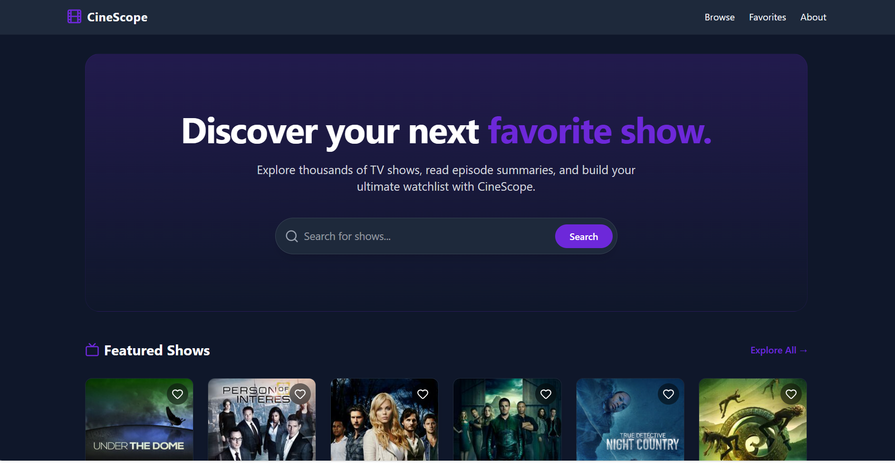
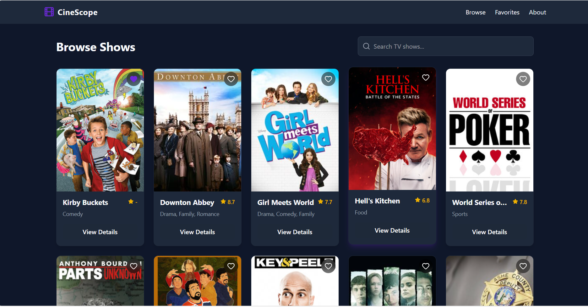
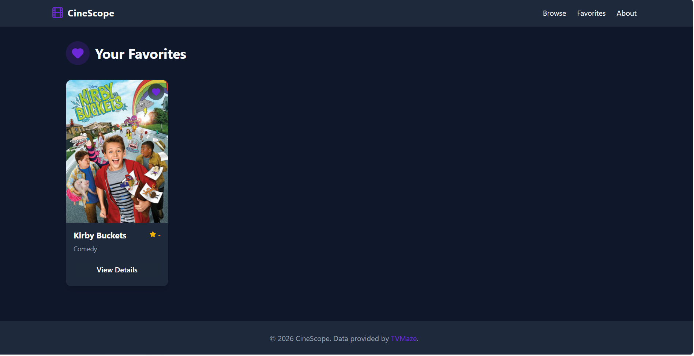
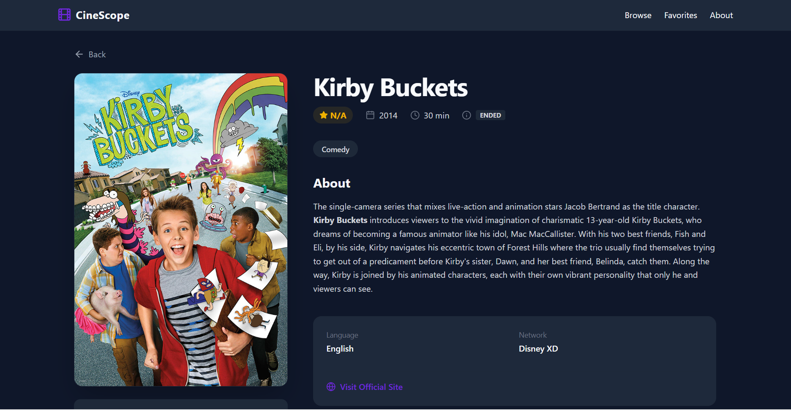
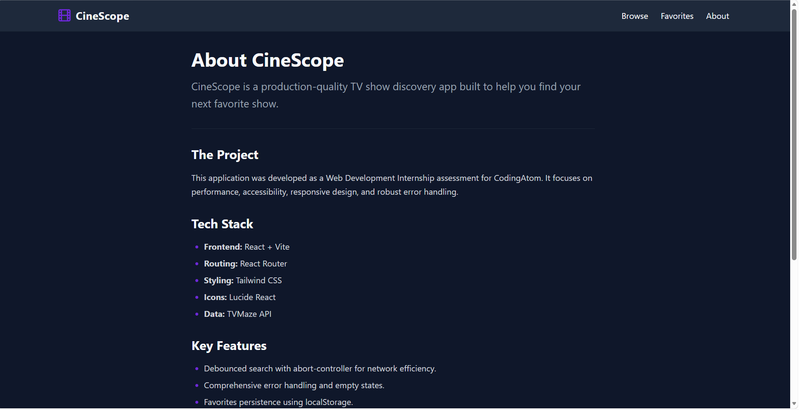
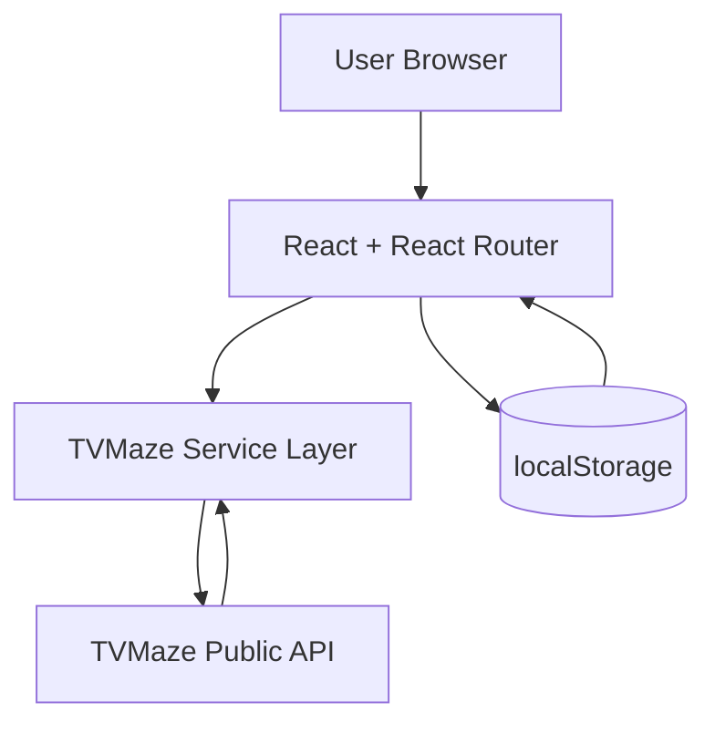

<div align="center">


# 🎬 CineScope

### Discover your next favorite show — a responsive, client-side TV show discovery app.

<br/>

[](add-deployed-url-here)
[](https://github.com/Nishanth2434/CineScope-TV-Discovery-App/stargazers)
[](https://github.com/Nishanth2434/CineScope-TV-Discovery-App/releases)

[](https://react.dev)
[](https://vitejs.dev)
[](https://tailwindcss.com)
[](https://www.tvmaze.com/api)

</div>

---

## 🌐 Live Demo

<div align="center">

### Try the live website here 👇

<a href="add-deployed-url-here">
  
</a>

<br/><br/>

| Area                   | URL                                                  |
| :--------------------- | :--------------------------------------------------- |
| 🎬 CineScope App       | [add-deployed-url-here](add-deployed-url-here)       |
| 🐙 GitHub Repository   | https://github.com/Nishanth2434/CineScope-TV-Discovery-App |

</div>

---

## 📸 A Look Inside — CineScope

<div align="center">

<b>🏠 Home — featured shows and quick search</b>



</div>

<table>
  <tr>
    <td width="50%"><b>🔍 Search & Browse Shows</b><br/></td>
    <td width="50%"><b>❤️ Favorites Watchlist</b><br/></td>
  </tr>
</table>

<div align="center">

<b>📺 Show Details — comprehensive info, rating, and episode list</b>



</div>

<table>
  <tr>
    <td width="50%"><b>ℹ️ About the Project</b><br/></td>
  </tr>
</table>

---

## ✨ Features

<table>
  <tr>
    <td width="33%">
      <h3>🔍 Debounced Search</h3>
      Lightning-fast, intelligent search (300-500ms delay) that avoids unnecessary API calls and layout thrashing.
    </td>
    <td width="33%">
      <h3>📺 Comprehensive Details</h3>
      View rich show profiles including ratings, genres, languages, runtime, sanitized descriptions, and a full episode guide.
    </td>
    <td width="33%">
      <h3>❤️ Persistent Favorites</h3>
      Curate your ultimate watchlist. Favorites are saved directly to <code>localStorage</code>, requiring zero login or backend setup.
    </td>
  </tr>
  <tr>
    <td>
      <h3>🛑 Request Cancellations</h3>
      Powered by <code>AbortController</code>, stale network requests are automatically cancelled to ensure your UI never displays outdated data.
    </td>
    <td>
      <h3>🛡️ Robust Error Handling</h3>
      Wrapped in a custom Error Boundary. Features dedicated loading skeletons, empty states, and friendly retry actions. No white screens!
    </td>
    <td>
      <h3>📱 Responsive Design</h3>
      Mobile-first layouts — carefully crafted CSS Grid layouts ensure the app looks stunning from 320px mobile screens up to desktop.
    </td>
  </tr>
</table>

<details>
<summary><b>🤖 Accessibility & Performance Extras</b></summary>

- **Focus Management** — Focus automatically moves to the `<h1>` tag upon route changes, aiding screen reader navigation.
- **Semantic HTML** — Strict adherence to semantic elements (`<nav>`, `<main>`, `<section>`, `<footer>`).
- **Zero Layout Shifts (CLS)** — Custom Loading Skeletons precisely match the dimensions of the final content, ensuring a perfectly stable UI during data fetching.
- **Optimized Images** — Images below the fold utilize `loading="lazy"` with strict `aspect-ratio` containers.

</details>

---

## 🧰 Tech Stack

| Layer               | Technology                                                |
| :------------------ | :-------------------------------------------------------- |
| **Frontend**        | React 19 + Vite                                           |
| **Routing**         | React Router DOM v7                                       |
| **Styling**         | Tailwind CSS v4                                           |
| **Data Fetching**   | Fetch API (`src/services/tvmaze.js`)                      |
| **State Storage**   | Browser `localStorage`                                    |
| **Icons**           | Lucide React                                              |
| **HTML Sanitizer**  | DOMPurify                                                 |
| **Data Provider**   | TVMaze API (Public, no auth required)                     |

---

## 🏗️ Architecture

CineScope was built with a focus on simplicity, speed, and modern web standards. By centralizing all API calls into a dedicated service layer rather than scattering `fetch` calls across components, the app remains scalable, easily testable, and highly maintainable.

```text
React Components (Pages & Layout)
        ↓
Custom Hooks (useDebounce, useFavorites)
        ↓
Service Layer (services/tvmaze.js)
        ↓
External API (TVMaze)
```



---

## 📂 Project Structure

```text
src/
├── components/
│   ├── Navbar, Footer, ShowCard, ShowGrid
│   ├── SearchBar, FavoriteButton
│   └── LoadingSkeleton, ErrorMessage, EmptyState, ErrorBoundary
├── pages/
│   └── Home, Shows, ShowDetails, Favorites, About, NotFound
├── services/
│   └── tvmaze.js (Centralized API client)
├── hooks/
│   └── useDebounce.js, useFavorites.js
├── utils/
│   └── helpers.js (HTML sanitation)
├── styles/
│   └── index.css
├── App.jsx
└── main.jsx
```

---

## 🚀 Installation & Setup

Want to run CineScope locally? Follow these simple steps:

```bash
# 1. Clone the repository
git clone https://github.com/Nishanth2434/CineScope-TV-Discovery-App.git

# 2. Navigate into the project directory
cd CineScope-TV-Discovery-App

# 3. Install NPM dependencies
npm install

# 4. Start the development server
npm run dev
```

To create a production-ready build:
```bash
npm run build
npm run preview
```

---

<div align="center">
  <p>Built with ❤️ for the CodingAtom Web Development Internship assessment.</p>
  <p><small>Data provided by <a href="https://www.tvmaze.com/">TVMaze</a>.</small></p>
</div>
